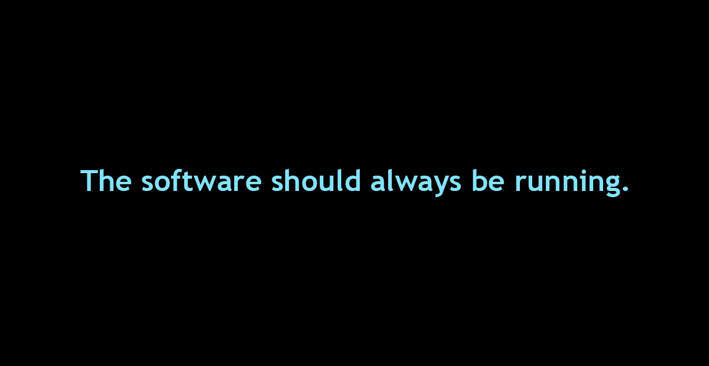
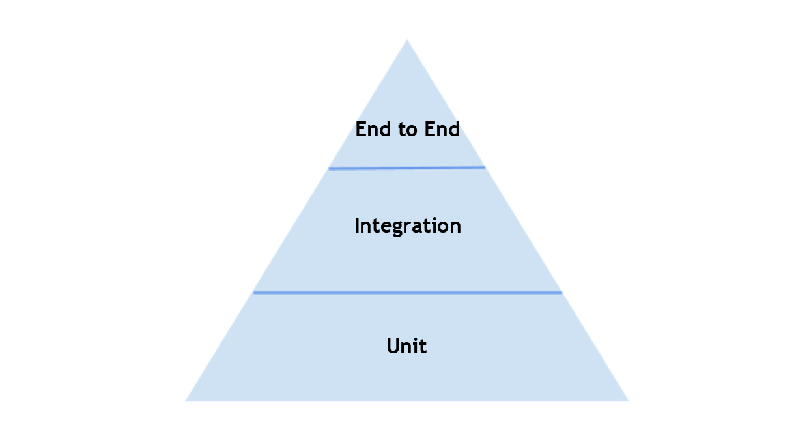
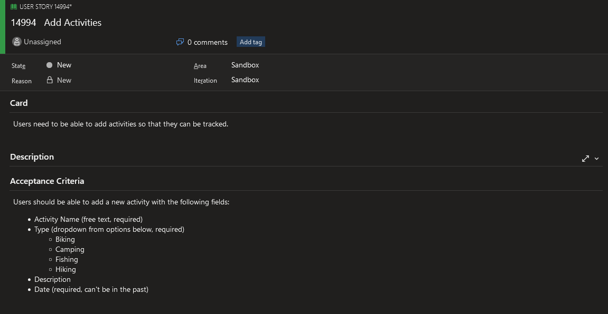
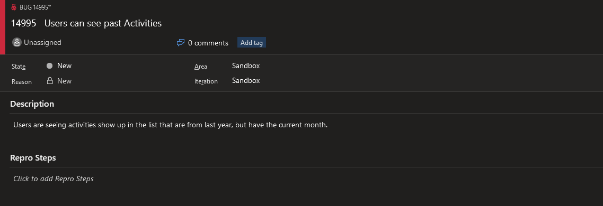
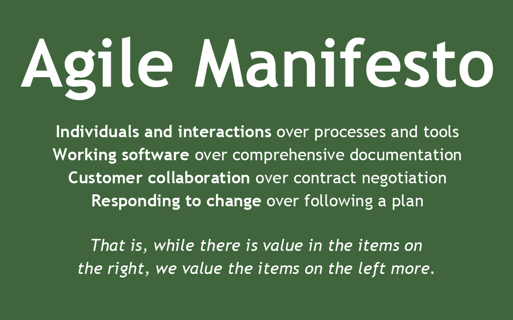

# Introduction

**Chad Levenhagen**

Bachelors of Science in Computer Science @ Luther College

Professional Development for almost a decade now

Test Driven Development & Extreme Programming for the last 3 years

Lead Developer for Polk County Information Technology

Primarily Full Stack .NET Web Applications

<br/>
<br/>
<br/>
<br/>
<br/>
<br/>
<br/>
<br/>
<br/>
<br/>

# Getting Started with Test Driven Development

<br/>
<br/>
<br/>
<br/>
<br/>
<br/>
<br/>
<br/>
<br/>
<br/>

    Imagine the ideal way that you would want to do something like building software.
    Forget about reality and the restrictions of it for a moment and think about what you would do if anything were possible.
    Now take the first step towards that ideal.

<br/>
<br/>
<br/>
<br/>
<br/>
<br/>
<br/>
<br/>
<br/>
<br/>


# A Little History

## Kent Beck - Inventor of TDD & Extreme Programming

<br/>

    "If an idea is really stupid it's definitely worth trying. If an idea is good and it turns out to be true somebody else will have done it. If an idea is stupid you have a chance that nobody else is dumb enough to try it. Then if it happens to work you really have something."

<br/>

### Extreme Programming

- Working as a consultant for Chrysler, helping them with a C3 payroll program to help with performance problems.
- At this point Beck is a huge TDD guy and he starts by asking where the tests are so that he knows he hasn't broken it as he works on it and gets told "Well it doesn't really work"

<br/>

    "I can make it really fast if it doesn't need to work"

<br/>

### The Shared Codebase Problem

- The above text is humorous but it represents a very real problem.

    How do we know that the changes we make to existing software aren't going to break seemingly unrelated pieces?

### Creation of Extreme Programming

<br/>

    "Inspiration is a Preparation plus Panic"

<br/>
 
- This is a 2 year old project that's been 6 months from release for a year and a half.
- Tells the CIO they have 3 options, ultimately ending in a rewrite where he gets put in charge, which is unexpected.
- Interviews staff one by one and throughout the day comes up with the framework for extreme programming.

<br/>

### Initial Framework
- 3 week iterations of working software
- Test Driven Development, with Stories containing the criteria
- Pair Programming
- Progress is measured by how much more of the input can be run correctly (The software is always running)

<br/>
<br/>
<br/>
<br/>
<br/>

## XP Practices, Values, and Principles
### The XP Practices: (Original 12, these have evolved over time)
- The Planning Game
- Small Releases
- Metaphor
- Simple Design
- Testing
- Refactoring
- Pair Programming
- Collective Ownership
- Continuous Integration
- 40-hour week
- On-site Customer
- Coding Standard

### The XP Values:
- **Communication**, Each team member is aware of what everyone else is doing
- **Simplicity**, Developers focus on writing the most simple and direct solutions
- **Feedback**, Constant tests and feedback loops keep the quality of product in check
- **Courage**, Each team member is focused on making the best choices for the project, even if it means having to discard failing solutions and approach things differently
- **Respect** (Added in 2nd Edition), Every team member is important and valuable to the project

### The XP Principles:
- **Humanity**, Remember that software is built by people, and there’s a balance between the needs of each team member and the project’s needs.
- **Economics**, Somebody is always paying for software project and everybody has to keep the budget in mind. 
- **Mutual benefit**, Search for practices that benefit the individual, the team, and the customer together. 
- **Self similarity**, The pattern of a monthly cycle is the same as a weekly cycle and the same as a daily cycle. 
- **Improvement**, Do your best today, and stay aware of what you need to do to get better tomorrow. 
- **Diversity**, Lots of different opinions and perspectives work together to come up with better solutions. 
- **Reflection**, Good teams stay aware of what’s working and what isn’t in their software process. 
- **Flow**, Constant delivery means a continuous flow of development work, not distinct phases. 
- **Opportunity**, Each problem the team encounters is a chance to learn something new about software development. 
- **Redundancy**, Even though it can seem wasteful at first blush, redundancy avoids big quality problems.
- **Failure**, You can learn a lot from failing. It’s OK to try things that don’t work. 
- **Quality**, You can’t deliver faster by accepting a lower quality product. 
- **Accepted responsibility**, If someone is responsible for something, they need to have the authority to get it done. 
- **Baby steps**, Take small steps in the right direction rather than making wholesale changes when adopting new practices.

<br/>
<br/>
<br/>
<br/>
<br/>

# Lean Manufacturing - TPS (Toyota Production System)

    The Toyota Way is a set of principles and behaviors that underlie the Toyota Motor Corporation's managerial approach and production system. 
    Toyota first summed up its philosophy, values, and manufacturing ideals in 2001, calling it "The Toyota Way 2001". 
    It consists of principles in two key areas: continuous improvement, and respect for people.

<br/>
<br/>
<br/>
<br/>
<br/>

Principle 1
- Base your management decisions on a long-term philosphy, even at the expense of short-term financial goals.

Principle 2
- Create a continuous process flow to bring problems to the surface (eliminate waste (muda) through the process of continuous improvement (kaizen))

Principle 3
- Use "pull" systems to avoid overproduction (the pull system produces material only after the next operation signals for it. This reduces overproduction)

Principle 4
- Level out the workload (do not overwork or overload people or equipment, maintain even levels of production)

Principle 5
- Build a culture of stopping to fix problems, to get the quality right the first time (any employee at Toyota Production System has the authority to stop the process to signal a quality issue)

Principle 6
- Standardized tasks and processes are the foundation for continuous improvement and employee empowerment (all employees are empowered to make improvements to any process)

Principle 7
- Use visual control so no problems are hidden (reduce time looking for needed tools and improve the work environment, everything should have a place and every place should have a thing! Includes the 5S program Sort, Straigthen, Shine, Standardize, Sustain)

Principle 8
- Use only reliable, thoroughly tested technology that serves your people and processes (tech is pulled by manufacturing, not pushed to manufacturing (Toyota vs others))

Principle 9
- Grow leaders who thoroughly understand the work, live the philosophy and teach it to others (without constant attention, the principles will fade. Some companies use a new employee orientation, at a Lean company every day is an employee orientation)

Principle 10
- Develop exceptional people and teams who follow your company's philosophy (success is based on the team, not the individual)

Principle 11
- Respect your extended network of partners and suppliers by challenging them and helping them improve (Toyota treats suppliers like they treat employees. They help them discover and fix problems so they can become better)

Principle 12
- Go and see for yourself to thoroughly understand the situation (without experiencing the situation firsthand, managers will not have an understanding of how it can be improved)

Principle 13
- Make decisions slowly by consensus, thoroughly considering all options; implement decisions rapidly.

Principle 14
- Become a learning organization through relentless reflection and continuous improvement

<br/>
<br/>
<br/>
<br/>
<br/>

## Eliminating Waste (muda) and Continuous Improvement (kaizen)

<br/>
<br/>

### **8 Areas of Waste**

Over Production
- Making more of a product than is required results in several forms of waste, typically caused by production in large batches. The customer's needs often change over the time it takes to produce a larger batch. Over-production has been described as the worst kind of waste

Over Processing
- Doing more to a product than is required by the end-customer results in it taking longer and costing more to produce. This also includes using components that are more precise, complex, expensive or higher quality than absolutely required

Excesss Inventory
- Raw materials, work in progress, or finished product represents capital that cannot yet produce an income (value).

Defects
- Having to discard or rework a product results in additional cost and delays

Transportation
- Every time a product is touched or moved unnecessarily there is a risk that it could be damaged, lost, delayed, etc. as well as being a cost for no added value.

Wasted Motion
- Motion refers to the damage and costs inflicted on what creates the product. This can include wear and tear for equipment, repetitive strain injuries for workers or unnecessary downtime. 

Waiting Time
- Whenever the product is not in transportation or being processed, it is waiting (typically in a queue). In traditional processes, a large part of an individual product's life is spent waiting to be worked on. 

Not Using Employee Genius
- Organizations often under-utilize the skills their workers have or permit workers to operate in silos so that knowledge is not shared.
*not an originally recognized form of waste but implied through the respect for people and their empowerment

<br/>
<br/>

### **Continuous Improvement**

- Never stop looking for lean improvements. "The moment you say this is lean, you've lost it."
- If you have no orders to fill, look for efficiencies. Clean and oil the machines.

<br/>
<br/>
<br/>
<br/>
<br/>

### **Additional Reading - 2 Second Lean**

Paul Akers 
- Author of 2 Second Lean (Free Book!) https://paulakers.net/books/2-second-lean
- "Lean is simply fixing what bugs you."

<br/>
<br/>
<br/>
<br/>
<br/>

# The Cost of Code

Any code we write has a cost associated with it. 
- It takes time to write, that we're wasting if isn't the absolute best thing we could be writing. 
- It takes time to maintain, that we're wasting if we have to spend a lot of time maintaining it.
- It takes time away from us when it breaks, which we're wasting if we have to rework it.
- It takes time if it's implemented poorly, which wastes time if it increases the complexity of other things we have to write on that project.
- It takes time if it's undocumented, which wastes time if we accidentally break it when we add new features or fix bugs.

<br/>
<br/>
<br/>
<br/>
<br/>

<br/>
<br/>
<br/>
<br/>
<br/>



<br/>
<br/>
<br/>
<br/>
<br/>

# Test Driven Development

## Robert Martin's Three Laws of Test Driven Development (TDD)


1. You are not allowed to write any production code unless it is to make a failing unit test pass.
2. You are not allowed to write any more of a unit test than is sufficient to fail; and compilation failures are failures.
3. You are not allowed to write any more production code than is sufficient to pass the one failing unit test.

<br/>

### Advantages

1. The code is always working
    - Once you've completed step 3, you have working code
    - You're not sitting in a broken state for very long
    - Rarely need to spend time using a debugger
2. Dozens of tests per day, hundreds per month, thousands per year
    - We can run these tests as often as we like
    - We can be reasonably sure that the code works so there's no concern with refactoring or cleaning up old code.
    - If a change happens to break something, we'll know right away.
3. Decoupling
    - In order to successfully test a module in isolation, it must be decoupled
    - This leads to better, less coupled designs
4. Documentation
    - The tests provide great examples of how to use the code
    - The tests describe how the code is suppose to work

<br/>
<br/>
<br/>
<br/>
<br/>

## Red Green Refactor


<br/>
<br/>
<br/>
<br/>
<br/>

# Let's write some code using Test Driven Development


<br/>
<br/>
<br/>
<br/>
<br/>

# Where to go next

    My general recommendation is to get your team bought into this philosophy and begin by isolating a single layer of your architecture.
    Strive for 100% Code Coverage of that layer by writing Unit Tests using Test Driven Development.
    In no time you'll have dozens of tests, then hundreds, and thousands by the time you release.


## The Testing Pyramid



## Types of Automated Tests

### Unit Tests

- Test Driven Development primarily focuses on Unit Tests, and does not exist without them
- Takes a small piece of the product and test that piece in isolation
- They tend to create an ideal feedback loop
- Primary Advantages
    1. Unit Tests are Fast
        - Tests run in fractions of a second and provide instant feedback
        - Fast tests are more valuable because they can be run more often
    2. Unit Tests are Reliable
        - Simple systems and small units tend to be less prone to variability
        - The reasons they might fail are straightforward
    3. Unit Tests Isolate Failures
        - Finding the reason for failure is fast and easy since the system under test is small and isolated

### Integration Tests

- Tests a small group of units (usually two) and tests their behavior as a whole
- Useful to prove that individual units work together
- Somewhere in the middle in terms of Unit Tests and End to End Tests, and overall can be a good compromise

### End to End Tests

- Runs the entire system and steps through it like a user would
- Meant to simulate real user scenarios
- Similar to manual testing through UI
- Disadvantages
    1. End to End Tests are Slow
        - Slow tests make your cycle time a lot longer and reduce value
    2. End to End Tests are Flaky
        - There's a lot of moving pieces being integrated and E2E tests aren't always predictable
        - Unreliable tests are often worse than having no tests at all
    3. End to End Tests find bugs
        - Finding bugs is great, but we want to prevent them
        - The system under test is so large, that figuring out what's actually breaking can be a time consuming process

<br/>
<br/>
<br/>
<br/>
<br/>

## Using Acceptance Criteria to Drive Tests

A good acceptance criteria should list all of the things you want to write automated tests for.

Consider the story below:



You can write a test case for each piece of the acceptance criteria.

This is probably going to be an add command of some kind that will require a model with validation. Write validator tests for each property of the model.

ex:
Activity Name (free text, required)
```
[Fact]
public void Name_WhenEmpty_IsInvalid() 
{
    // Arrange
    var validator = new AddActivityModelValidator();

    // Act
    var validationResult = validator.TestValidate(new AddActivityModel() { Name = string.Empty });
        
    // Assert
    validationResult.ShouldHaveValidationErrorFor(m => m.Name).WithMessage("Name is required.");
}

[Fact]
public void Name_WhenNotEmpty_IsValid()
{
    // Arrange
    var validator = new AddActivityModelValidator();

    // Act
    var validationResult = validator.TestValidate(new AddActivityModel() { Name = "Bike Trip!" });

    // Assert
    validationResult.ShouldNotHaveValidationErrorFor(m => m.Name)
}
```

Write tests for what actually happens when you call the command that adds the activity.

```
[Fact]
public async Task NewActivity_IsAddedToContext_WithValuesFromModel()
{
    // Arrange
    var testAddActivityModel = new AddActivityModel()
    {
        Name = Guid.NewGuid().ToString(),
        Type = ActivityTypeConstants.Biking,
        Description = Guid.NewGuid().ToString(),
        Date = new DateTime(3000, 1, 1)
    };

    // Act
    await _handler.Handle(new AddActivityCommand(testAddActivityModel));

    // Assert
    var newActivity = _applicationDbContext.Activities.First();

    newActivity.Name.Should().Be(testAddActivityModel.Name);
    newActivity.Type.Should().Be(testAddActivityModel.Type);
    newActivity.Description.Should().Be(testAddActivityModel.Description);
    newActivity.Date.Should().Be(testAddActivityModel.Date);
}
```

## Bugs

Consider the following bug report.



Add a new test for the exact case mentioned in the bug.

```
[Fact]
public async Task Dates_HavingPreviousYears_AndTheCurrentMonth_AreNotReturned()
{
    // Arrange some data using a date in the past that shouldn't show
    var testDate = new DateTime(3000, 1, 1);

    var testActivity = new Activity()
    {
        ...
        Date = testDate.AddYears(-1)
    }
    ... (add to context and save)

    // Act
    var results = await _handler.Handle(new GetUpcomingActivitiesQuery());

    // Assert
    results.Should().BeEmpty();
}

```

<br/>
<br/>
<br/>
<br/>
<br/>

# How We Do It


## The Robust Way

1. Pair Programming or Mob Programming always
    - Use screen sharing with multiple monitors
    - "Driver" writes the tests
    - "Passenger" writes the production code
    - Reduce rework by having Live PR Review

2. 100% Test Coverage of everything in our control
    - TDD every unit
    - Focus is on team alignment over coverage checks

3. Mob Pull Requests
    - The software should always be running, faster feedback loops is the goal
    - Code isn't personal, and refactor suggestions are encouraged
    - Acceptance Criteria is reflected in the tests

4. Continuous Integration
    - Pull Requests trigger unique dev environment deployments (ex: app-url/pr-number/)
    - Any failing test prevents merging
    - Merges trigger QA environment deployment
    - Tagging triggers Production environment deployment

<br/>
<br/>
<br/>
<br/>
<br/>

# It's About the People, Not the Tools

1. Pointing Pet Problem
    - People tend to focus too heavily on the tools
2. Team Alignment over Processes
    - I would choose a well aligned team dedicated to testing over a code coverage tool
    - The best processes will fail if one person is willing to throw it aside
3. Test Driven Development is not a Panacea
    - There is no silver bullet
    - You'll still want a QA team

<br/>
<br/>
<br/>
<br/>
<br/>

**Build a culture around testing**

<br/>
<br/>
<br/>
<br/>
<br/>

## Agile Manifesto



<br/>
<br/>
<br/>
<br/>
<br/>

# Going Outdoors

